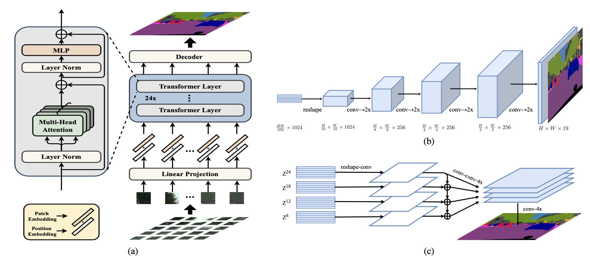

# SEgmentation TRansformers -- SETR

### SETR



> [**Rethinking Semantic Segmentation from a Sequence-to-Sequence Perspective with Transformers**](https://arxiv.org/abs/2012.15840) <br>
> Sixiao Zheng, Jiachen Lu, Hengshuang Zhao, Xiatian Zhu, Zekun Luo, Yabiao Wang, Yanwei Fu, Jianfeng Feng, Tao Xiang, Philip HS Torr, Li Zhang <br>
> *CVPR 2021*

> [**Vision Transformers: From Semantic Segmentation to Dense Prediction**](https://link.springer.com/article/10.1007/s11263-024-02173-w) [[Springer](https://link.springer.com/article/10.1007/s11263-024-02173-w)] [[arxiv](https://arxiv.org/abs/2207.09339)] <br>
> Li Zhang, Jiachen Lu, Sixiao Zheng, Xinxuan Zhao, Xiatian Zhu, Yanwei Fu, Tao Xiang, Jianfeng Feng <br>
> *IJCV 2024 July*

## SETR

#### Cityscapes

| Method          | Crop Size | Batch size | iteration | set | mIoU  | model                                                                                           | config                                                             |
| --------------- | --------- | ---------- | --------- | --- | ----- | ----------------------------------------------------------------------------------------------- | ------------------------------------------------------------------ |
| SETR-Naive      | 768x768   | 8          | 40k       | val | 77.37 | [google drive](https://drive.google.com/file/d/1f3b7I7IwKx-hcr16afjcxkAyXyeNQCAz/view?usp=sharing) | [config](configs/SETR/SETR_Naive_768x768_40k_cityscapes_bs_8.py)      |
| SETR-Naive      | 768x768   | 8          | 80k       | val | 77.90 | [google drive](https://drive.google.com/file/d/1dplB4wceJhyVRQfZR5AWODywMN90CY0h/view?usp=sharing) | [config](configs/SETR/SETR_Naive_768x768_80k_cityscapes_bs_8.py)      |
| SETR-MLA        | 768x768   | 8          | 40k       | val | 76.65 | [google drive](https://drive.google.com/file/d/18k26X-xM7BEQZUjzkvroeGV-6XwPgBqN/view?usp=sharing) | [config](configs/SETR/SETR_MLA_768x768_40k_cityscapes_bs_8.py)        |
| SETR-MLA        | 768x768   | 8          | 80k       | val | 77.24 | [google drive](https://drive.google.com/file/d/1ke6wcsCwP_J-p8sYriCZ3pC8G61bE0v_/view?usp=sharing) | [config](configs/SETR/SETR_MLA_768x768_80k_cityscapes_bs_8.py)        |
| SETR-PUP        | 768x768   | 8          | 40k       | val | 78.39 | [google drive](https://drive.google.com/file/d/1DcZltdh6eHwmQ5BvCdHudJRgJUjPzS56/view?usp=sharing) | [config](configs/SETR/SETR_PUP_768x768_40k_cityscapes_bs_8.py)        |
| SETR-PUP        | 768x768   | 8          | 80k       | val | 79.34 | [google drive](https://drive.google.com/file/d/1469aYtEAuhT39BrHn0yOv1s71unF85JE/view?usp=sharing) | [config](configs/SETR/SETR_PUP_768x768_80k_cityscapes_bs_8.py)        |
| SETR-Naive-Base | 768x768   | 8          | 40k       | val | 75.54 | [google drive](https://drive.google.com/file/d/1kGzdSLCazsbgZe0Y1Lo6sNwv9s5V3CAp/view?usp=sharing) | [config](configs/SETR/SETR_Naive_Base_768x768_40k_cityscapes_bs_8.py) |
| SETR-Naive-Base | 768x768   | 8          | 80k       | val | 76.25 | [google drive](https://drive.google.com/file/d/1vOD1-PGNfuM9IUvwnm2CrAXsPkadoyW8/view?usp=sharing) | [config](configs/SETR/SETR_Naive_Base_768x768_80k_cityscapes_bs_8.py) |
| SETR-Naive-DeiT | 768x768   | 8          | 40k       | val | 77.85 | [google drive]()                                                                                   | [config](configs/SETR/SETR_Naive_DeiT_768x768_40k_cityscapes_bs_8.py) |
| SETR-Naive-DeiT | 768x768   | 8          | 80k       | val | 78.66 | [google drive]()                                                                                   | [config](configs/SETR/SETR_Naive_DeiT_768x768_80k_cityscapes_bs_8.py) |
| SETR-MLA-DeiT   | 768x768   | 8          | 40k       | val | 78.04 | [google drive]()                                                                                   | [config](configs/SETR/SETR_MLA_DeiT_768x768_40k_cityscapes_bs_8.py)   |
| SETR-MLA-DeiT   | 768x768   | 8          | 80k       | val | 78.98 | [google drive]()                                                                                   | [config](configs/SETR/SETR_MLA_DeiT_768x768_80k_cityscapes_bs_8.py)   |
| SETR-PUP-DeiT   | 768x768   | 8          | 40k       | val | 78.79 | [google drive]()                                                                                   | [config](configs/SETR/SETR_PUP_DeiT_768x768_40k_cityscapes_bs_8.py)   |
| SETR-PUP-DeiT   | 768x768   | 8          | 80k       | val | 79.45 | [google drive]()                                                                                   | [config](configs/SETR/SETR_PUP_DeiT_768x768_80k_cityscapes_bs_8.py)   |

#### ADE20K

| Method        | Crop Size | Batch size | iteration | set | mIoU  | mIoU(ms+flip) | model                                                                                           | Config                                                         |
| ------------- | --------- | ---------- | --------- | --- | ----- | ------------- | ----------------------------------------------------------------------------------------------- | -------------------------------------------------------------- |
| SETR-Naive    | 512x512   | 16         | 160k      | Val | 48.06 | 48.80         | [google drive](https://drive.google.com/file/d/17ZlPBcJRKO3c3XoAeNutrExIETu23qKY/view?usp=sharing) | [config](configs/SETR/SETR_Naive_512x512_160k_ade20k_bs_16.py)    |
| SETR-MLA      | 512x512   | 8          | 160k      | val | 47.79 | 50.03         | [google drive](https://drive.google.com/file/d/1Zcaut5LAKYibjyeCcD3m-aG-ETWW6uhA/view?usp=sharing) | [config](configs/SETR/SETR_MLA_512x512_160k_ade20k_bs_8.py)       |
| SETR-MLA      | 512x512   | 16         | 160k      | val | 48.64 | 50.28         | [google drive]()                                                                                   | [config](configs/SETR/SETR_MLA_512x512_160k_ade20k_bs_16.py)      |
| SETR-MLA-Deit | 512x512   | 16         | 160k      | val | 46.15 | 47.71         | [google drive]()                                                                                   | [config](configs/SETR/SETR_MLA_DeiT_512x512_160k_ade20k_bs_16.py) |
| SETR-PUP      | 512x512   | 16         | 160k      | val | 48.62 | 50.09         | [google drive](https://drive.google.com/file/d/1hCeiz60ITgVPkWsrKwah8JnwM3G8VVL4/view?usp=sharing) | [config](configs/SETR/SETR_PUP_512x512_160k_ade20k_bs_16.py)      |
| SETR-PUP-Deit | 512x512   | 16         | 160k      | val | 46.34 | 47.30         | [google drive]()                                                                                   | [config](configs/SETR/SETR_PUP_DeiT_512x512_160k_ade20k_bs_16.py) |

#### Pascal Context

| Method        | Crop Size | Batch size | iteration | set | mIoU  | mIoU(ms+flip) | model                                                                                           | Config                                                                |
| ------------- | --------- | ---------- | --------- | --- | ----- | ------------- | ----------------------------------------------------------------------------------------------- | --------------------------------------------------------------------- |
| SETR-Naive    | 480x480   | 16         | 80k       | val | 52.89 | 53.61         | [google drive](https://drive.google.com/file/d/140T7-wQ3UOzHA0-6pjO3lik_5Vi5RvqJ/view?usp=sharing) | [config](configs/SETR/SETR_Naive_480x480_80k_pascal_context_bs_16.py)    |
| SETR-MLA      | 480x480   | 8          | 80k       | val | 54.39 | 55.39         | [google drive](https://drive.google.com/file/d/1XvhUVIMcdcEYUYKudUcV99vOwhisYh61/view?usp=sharing) | [config](configs/SETR/SETR_MLA_480x480_80k_pascal_context_bs_8.py)       |
| SETR-MLA      | 480x480   | 16         | 80k       | val | 55.01 | 55.83         | [google drive](https://drive.google.com/file/d/1k5CwpKfpNUdAFWOuzwWz9PrRwiGS0Xu9/view?usp=sharing) | [config](configs/SETR/SETR_MLA_480x480_80k_pascal_context_bs_16.py)      |
| SETR-MLA-DeiT | 480x480   | 16         | 80k       | val | 52.91 | 53.74         | [google drive]()                                                                                   | [config](configs/SETR/SETR_MLA_DeiT_480x480_80k_pascal_context_bs_16.py) |
| SETR-PUP      | 480x480   | 16         | 80k       | val | 54.37 | 55.27         | [google drive](https://drive.google.com/file/d/1kXZYyqjA96d2DTL-tRvQjixfDBIZFIyR/view?usp=sharing) | [config](configs/SETR/SETR_PUP_480x480_80k_pascal_context_bs_16.py)      |
| SETR-PUP-DeiT | 480x480   | 16         | 80k       | val | 52.00 | 52.50         | [google drive]()                                                                                   | [config](configs/SETR/SETR_PUP_DeiT_480x480_80k_pascal_context_bs_16.py) |

## HLG

#### ImageNet-1K

HLG classification is under folder `hlg-classification/`.

| Model      | Resolution | Params | FLOPs | Top-1 % | Config                                                                 | Pretrained Model                                                                                   |
| ---------- | :--------: | :----: | :---: | :-----: | ---------------------------------------------------------------------- | -------------------------------------------------------------------------------------------------- |
| HLG-Tiny   |    224    |  11M  | 2.1G |  81.1  | [hlg_tiny_224.yaml](hlg-classification/configs/hlg/hlg_tiny_224.yaml)     | [google drive](https://drive.google.com/file/d/1eViEOBV7-y1Uoft7DNa_rtCZcF0W_g7S/view?usp=share_link) |
| HLG-Small  |    224    |  24M  | 4.7G |  82.3  | [hlg_small_224.yaml](hlg-classification/configs/hlg/hlg_small_224.yaml)   | [google drive](https://drive.google.com/file/d/1B4qLFBHLozTG96ULWZuTJz5q3bsz8vNr/view?usp=share_link) |
| HLG-Medium |    224    |  43M  | 9.0G |  83.6  | [hlg_medium_224.yaml](hlg-classification/configs/hlg/hlg_medium_224.yaml) | [google drive](https://drive.google.com/file/d/1nax3Ez3s_MPEVp-ZHmtqPClmARsluOoS/view?usp=share_link) |
| HLG-Large  |    224    |  84M  | 15.9G |  84.1  | [hlg_large_224.yaml](hlg-classification/configs/hlg/hlg_large_224.yaml)   | [google drive](https://drive.google.com/file/d/1IDN-oNEL58w702E_LntvUetChNSDSerH/view?usp=share_link) |

#### Cityscapes

HLG segmentation shares the same folder as SETR.

| Method          | Crop Size | Batch size | iteration | set | mIoU | config                                                                      |
| --------------- | --------- | ---------- | --------- | --- | ---- | --------------------------------------------------------------------------- |
| SETR-HLG-Small  | 768x768   | 16         | 40k       | val | 81.8 | [config](configs/setr_hlg/setr_pup_hlg_small_768x768_40k_cityscapes_bs_16.py)  |
| SETR-HLG-Medium | 768x768   | 16         | 40k       | val | 82.5 | [config](configs/setr_hlg/setr_pup_hlg_medium_768x768_40k_cityscapes_bs_16.py) |
| SETR-HLG-Large  | 768x768   | 16         | 40k       | val | 82.9 | [config](configs/setr_hlg/setr_pup_hlg_large_768x768_40k_cityscapes_bs_16.py)  |

#### ADE20K

HLG segmentation shares the same folder as SETR.

| Method          | Crop Size | Batch size | iteration | set | mIoU | Config                                                                   |
| --------------- | --------- | ---------- | --------- | --- | ---- | ------------------------------------------------------------------------ |
| SETR-HLG-Small  | 512x512   | 16         | 160k      | Val | 47.3 | [config](configs/setr_hlg/setr_pup_hlg_small_512x512_160k_ade20k_bs_16.py)  |
| SETR-HLG-Medium | 512x512   | 16         | 160k      | Val | 49.3 | [config](configs/setr_hlg/setr_pup_hlg_medium_512x512_160k_ade20k_bs_16.py) |
| SETR-HLG-Large  | 512x512   | 16         | 160k      | Val | 49.8 | [config](configs/setr_hlg/setr_pup_hlg_large_512x512_160k_ade20k_bs_16.py)  |

#### COCO

HLG detection is under folder `hlg-detection/`.

| Backbone        | Lr schd | box AP | Config                                                                                 |
| --------------- | ------- | ------ | -------------------------------------------------------------------------------------- |
| SETR-HLG-Small  | 1x      | 44.4   | [config](hlg-detection/configs/retinanet_hlg/retinanet_hlg_small_fpn_mstrain_1x_coco.py)  |
| SETR-HLG-Medium | 1x      | 46.6   | [config](hlg-detection/configs/retinanet_hlg/retinanet_hlg_medium_fpn_mstrain_1x_coco.py) |
| SETR-HLG-Large  | 1x      | 47.7   | [config](hlg-detection/configs/retinanet_hlg/retinanet_hlg_large_fpn_mstrain_1x_coco.py)  |

## Installation

Our project is developed based on [MMsegmentation](https://github.com/open-mmlab/mmsegmentation). Please follow the official MMsegmentation [INSTALL.md](docs/install.md) and [getting_started.md](docs/getting_started.md) for installation and dataset preparation.

🔥🔥 SETR is on [MMsegmentation](https://github.com/open-mmlab/mmsegmentation/tree/master/configs/setr). 🔥🔥

### A from-scratch setup script

#### Linux

Here is a full script for setting up SETR with conda and link the dataset path (supposing that your dataset path is $DATA_ROOT).

```shell
conda create -n open-mmlab python=3.7 -y
conda activate open-mmlab

conda install pytorch=1.6.0 torchvision cudatoolkit=10.1 -c pytorch -y
pip install mmcv-full==1.2.2 -f https://download.openmmlab.com/mmcv/dist/cu101/torch1.6.0/index.html
git clone https://github.com/fudan-zvg/SETR.git
cd SETR
pip install -e .  # or "python setup.py develop"
pip install -r requirements/optional.txt

mkdir data
ln -s $DATA_ROOT data
```

#### Windows(Experimental)

Here is a full script for setting up SETR with conda and link the dataset path (supposing that your dataset path is
%DATA_ROOT%. Notice: It must be an absolute path).

```shell
conda create -n open-mmlab python=3.7 -y
conda activate open-mmlab

conda install pytorch=1.6.0 torchvision cudatoolkit=10.1 -c pytorch
set PATH=full\path\to\your\cpp\compiler;%PATH%
pip install mmcv

git clone https://github.com/fudan-zvg/SETR.git
cd SETR
pip install -e .  # or "python setup.py develop"
pip install -r requirements/optional.txt

mklink /D data %DATA_ROOT%
```

## Get Started

### Pre-trained model

The pre-trained model will be automatically downloaded and placed in a suitable location when you run the training command. If you are unable to download due to network reasons, you can download the pre-trained model from [here](https://github.com/rwightman/pytorch-image-models/releases/download/v0.1-vitjx/jx_vit_large_p16_384-b3be5167.pth) (ViT) and [here](https://dl.fbaipublicfiles.com/deit/deit_base_distilled_patch16_384-d0272ac0.pth) (DeiT).

### Train

```shell
./tools/dist_train.sh ${CONFIG_FILE} ${GPU_NUM} 
# For example, train a SETR-PUP on Cityscapes dataset with 8 GPUs
./tools/dist_train.sh configs/SETR/SETR_PUP_768x768_40k_cityscapes_bs_8.py 8
```

* Tensorboard

  If you want to use tensorboard, you need to `pip install tensorboard` and uncomment the Line 6 `dict(type='TensorboardLoggerHook')` of `SETR/configs/_base_/default_runtime.py`.

### Single-scale testing

```shell
./tools/dist_test.sh ${CONFIG_FILE} ${CHECKPOINT_FILE} ${GPU_NUM}  [--eval ${EVAL_METRICS}]
# For example, test a SETR-PUP on Cityscapes dataset with 8 GPUs
./tools/dist_test.sh configs/SETR/SETR_PUP_768x768_40k_cityscapes_bs_8.py \
work_dirs/SETR_PUP_768x768_40k_cityscapes_bs_8/iter_40000.pth \
8 --eval mIoU
```

### Multi-scale testing

Use the config file ending in `_MS.py` in `configs/SETR`.

```shell
./tools/dist_test.sh ${CONFIG_FILE} ${CHECKPOINT_FILE} ${GPU_NUM}  [--eval ${EVAL_METRICS}]
# For example, test a SETR-PUP on Cityscapes dataset with 8 GPUs
./tools/dist_test.sh configs/SETR/SETR_PUP_768x768_40k_cityscapes_bs_8_MS.py \
work_dirs/SETR_PUP_768x768_40k_cityscapes_bs_8/iter_40000.pth \
8 --eval mIoU
```

### Generate the png files to be submit to the official evaluation server

* Cityscapes

  First, add following to config file `configs/SETR/SETR_PUP_768x768_40k_cityscapes_bs_8.py`,

  ```python
  data = dict(
      test=dict(
          img_dir='leftImg8bit/test',
          ann_dir='gtFine/test'))
  ```

  Then run test

  ```shell
  ./tools/dist_test.sh configs/SETR/SETR_PUP_768x768_40k_cityscapes_bs_8.py \
      work_dirs/SETR_PUP_768x768_40k_cityscapes_bs_8/iter_40000.pth \
      8 --format-only --eval-options "imgfile_prefix=./SETR_PUP_768x768_40k_cityscapes_bs_8_test_results"
  ```

  You will get png files under directory `./SETR_PUP_768x768_40k_cityscapes_bs_8_test_results`.
  Run `zip -r SETR_PUP_768x768_40k_cityscapes_bs_8_test_results.zip SETR_PUP_768x768_40k_cityscapes_bs_8_test_results/` and submit the zip file to [evaluation server](https://www.cityscapes-dataset.com/submit/).
* ADE20k

  ADE20k dataset could be download from this [link](http://sceneparsing.csail.mit.edu/)

  First, add following to config file `configs/SETR/SETR_PUP_512x512_160k_ade20k_bs_16.py`,

  ```python
  data = dict(
      test=dict(
          img_dir='images/testing',
          ann_dir='annotations/testing'))
  ```

  Then run test

  ```shell
  ./tools/dist_test.sh configs/SETR/SETR_PUP_512x512_160k_ade20k_bs_16.py \
      work_dirs/SETR_PUP_512x512_160k_ade20k_bs_16/iter_1600000.pth \
      8 --format-only --eval-options "imgfile_prefix=./SETR_PUP_512x512_160k_ade20k_bs_16_test_results"
  ```

  You will get png files under `./SETR_PUP_512x512_160k_ade20k_bs_16_test_results` directory.
  Run `zip -r SETR_PUP_512x512_160k_ade20k_bs_16_test_results.zip SETR_PUP_512x512_160k_ade20k_bs_16_test_results/` and submit the zip file to [evaluation server](http://sceneparsing.csail.mit.edu/eval/login.php).

Please see [getting_started.md](docs/getting_started.md) for the more basic usage of training and testing.

## Reference

```bibtex
@inproceedings{SETR,
    title={Rethinking Semantic Segmentation from a Sequence-to-Sequence Perspective with Transformers}, 
    author={Zheng, Sixiao and Lu, Jiachen and Zhao, Hengshuang and Zhu, Xiatian and Luo, Zekun and Wang, Yabiao and Fu, Yanwei and Feng, Jianfeng and Xiang, Tao and Torr, Philip H.S. and Zhang, Li},
    booktitle={CVPR},
    year={2021}
}
```

```bibtex
@article{SETR-HLG,
  title={Vision transformers: From semantic segmentation to dense prediction},
  author={Zhang, Li and Lu, Jiachen and Zheng, Sixiao and Zhao, Xinxuan and Zhu, Xiatian and Fu, Yanwei and Xiang, Tao and Feng, Jianfeng and Torr, Philip HS},
  journal={International Journal of Computer Vision},
  pages={1--21},
  year={2024},
  publisher={Springer}
}
```

## License

MIT

## Acknowledgement

Thanks to previous open-sourced repo:
[MMsegmentation](https://github.com/open-mmlab/mmsegmentation)
[pytorch-image-models](https://github.com/rwightman/pytorch-image-models)
